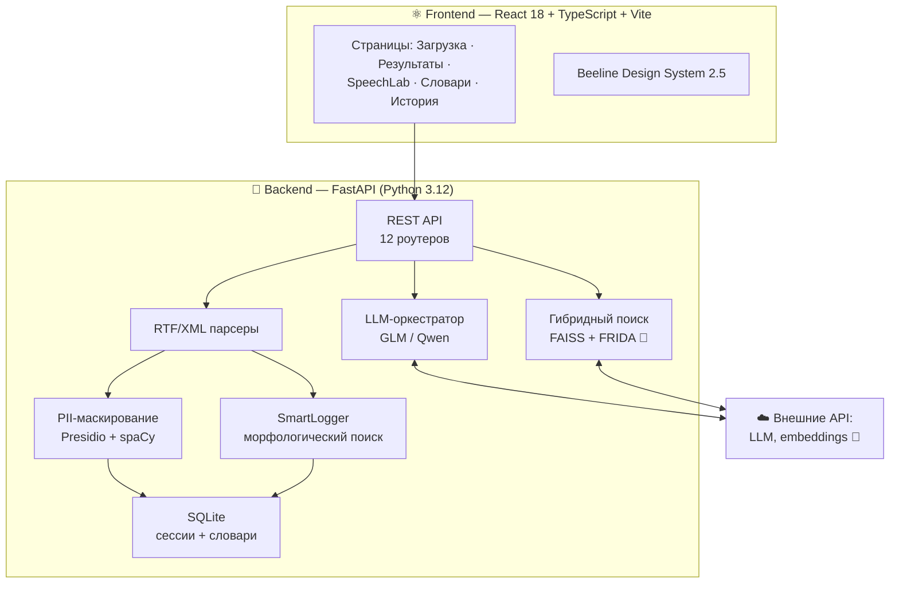
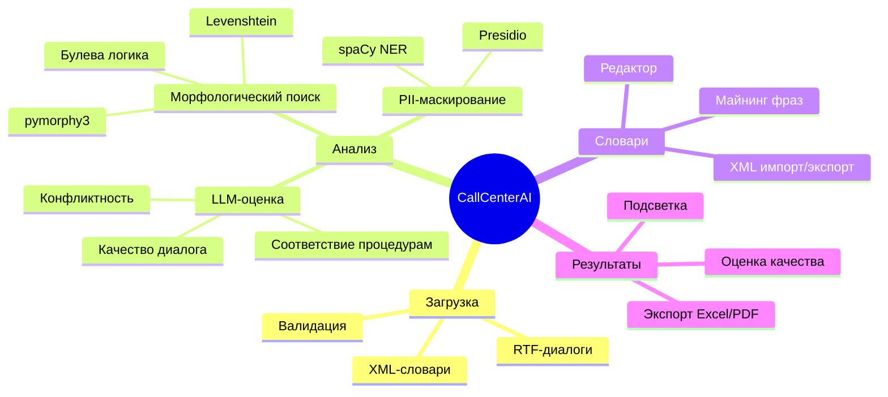

<div align="center">

# 🎙️ CallCenterAI

**Платформа интеллектуального анализа диалогов колл-центра: морфологический поиск по словарям, LLM-анализ, маскирование персональных данных и семантический поиск.**

[](#-статус-проекта)
[](#-статус-проекта)
[](#-стек)
[](#-стек)

[](#-тестирование)
[](#-тестирование)
[](#-тестирование)
[](#-лицензия)

</div>

---

## 📖 О проекте

**CallCenterAI** превращает расшифровки звонков (RTF) в структурированную аналитику:

> 📥 Загружаешь диалог → 🔍 система находит ключевые фразы по корпоративным словарям (морфология, словоформы, расстояние Левенштейна) → 🤖 LLM оценивает качество, конфликтность и соответствие процедурам → 🕵️ персональные данные маскируются автоматически → 📊 результат с подсветкой, оценкой качества и экспортом в Excel/PDF.

Проект построен как **внутренний инструмент для аналитиков** колл-центра и задуман как основа (скелет) для развития в разных направлениях.

<details>
<summary>📷 Почему нет скриншотов интерфейса?</summary>

Интерфейс отлаживался на реальных диалогах клиентов, содержащих персональные данные и коммерческую тайну. В целях конфиденциальности скриншоты в репозиторий не включены — их нельзя «быстро воссоздать», но можно легко получить, запустив проект.

</details>

---

## 📊 Статус проекта

> ⚠️ **Проект находится в активной разработке.** Ниже — честная картина готовности каждого модуля.

| Модуль | Готовность | Статус |
|---|:---:|:---:|
| 📥 Загрузка и парсинг RTF-диалогов (включая batch) | `██████████ 100%` | ✅ готово |
| 🔍 Морфологический поиск (SmartLogger) | `██████████ 100%` | ✅ готово |
| 🕵️ PII-маскирование (Presidio + spaCy) | `██████████ 100%` | ✅ готово |
| 📤 Экспорт результатов (Excel / PDF) | `██████████ 100%` | ✅ готово |
| 📜 История сессий и восстановление | `██████████ 100%` | ✅ готово |
| ⛏️ Майнинг словарей (подбор фраз) | `██████████ 100%` | ✅ готово |
| ✏️ Редактор словарей (CRUD + XML) | `██████████ 100%` | ✅ готово |
| 🌳 Режим «Структура» в результатах | `██████████ 100%` | ✅ готово |
| 👍 Feedback по совпадениям (like/duplicate) | `██████████ 100%` | ✅ готово |
| 🤖 LLM-анализ (качество, конфликты) | `████████░░ 85%` | 🚧 в работе¹ |
| 🔎 Семантический поиск (гибридный) | `█████████░ 90%` | ✅ локальный режим² |
| ⏱️ Извлечение таймкодов из RTF | `░░░░░░░░░░ 0%` | 📋 ограничение³ |

**Общая готовность по backlog: 45 из 53 задач (85%)** — все 8 незакрытых пунктов низкого приоритета (Phase G mining v2).

¹ — LLM-сводка периодически недоступна из-за внешнего API; интерфейс корректно показывает fallback
² — работает офлайн на встроенном TF-IDF-провайдере (`EMBEDDING_PROVIDER=local|frida|auto` с авто-fallback); векторный поиск FRIDA подключается автоматически при доступности API
³ — парсер RTF не извлекает временные метки из имеющихся файлов расшифровок; фильтр по временным промежуткам работает в unit-тестах, но на реальных данных пока no-op

---

## ✨ Возможности

### ✅ Реализовано

- **Загрузка диалогов** — RTF-файлы расшифровок звонков, валидация, **batch-режим (пакетная загрузка и анализ)**
- **Поиск по словарям** — морфологический анализ (pymorphy3), словоформы, опечатки (Levenshtein), каналы (оператор/клиент/оба), вложенные условия и булева логика, временные ограничения
- **PII-маскирование** — имена, телефоны, адреса и другие персональные данные скрываются до сохранения в базу (Presidio + spaCy, режим 152-ФЗ)
- **LLM-анализ** — оценка качества диалога, конфликтность, соответствие процедурам, рекомендации
- **Подсветка результатов** — цветовое кодирование по каналам и уровням совпадений, точные совпадения с пунктирным подчёркиванием, попапы с деталями фразы
- **Семантический поиск** — гибридный (лексический + векторный) с офлайн TF-IDF-провайдером и авто-подключением FRIDA при доступности
- **Режим «Структура»** — дерево совпадений по секциям словаря с подсчётом по узлам
- **Feedback по совпадениям** — like/duplicate отправляются в backend и используются для улучшения словарей
- **Экспорт** — Excel и PDF отчёты с результатами анализа
- **Редактор словарей** — дерево узлов, CRUD условий, импорт/экспорт XML, статистика, валидация, поиск дубликатов, AI-анализ словаря
- **Майнинг фраз** — автоматический подбор недостающих ключевых фраз для словаря из корпуса диалогов
- **История сессий** — сохранение, TTL-очистка, восстановление анализа по ссылке

### 🚧 В разработке

- **Устойчивость LLM-анализа** — ретраи и fallback-режимы при недоступности внешних моделей (каркас готов)

### 📋 В планах / отложено

- Режим просмотра «Структура» (дерево результатов поиска)
- Извлечение таймкодов из RTF-расшифровок
- 9 низкоприоритетных пунктов backlog (см. `TODO_AND_ROADMAP.md`)

---

## 🏗️ Архитектура



<details>
<summary>📋 Полная карта доменов и слоёв</summary>



Подробности: [`ARCHITECTURE.md`](ARCHITECTURE.md) · [`DOMAIN_LOGIC.md`](DOMAIN_LOGIC.md) · [`openwiki/`](openwiki/)

</details>

---

## 🚀 Быстрый старт

### Требования

| Компонент | Версия |
|---|---|
| Node.js | ≥ 20 |
| Python | ≥ 3.12 |
| npm | ≥ 10 |

> ⚠️ **Важно:** фронтенд использует `@beeline/design-system-react` из корпоративного npm-registry. Для установки вне корпоративной сети потребуется заменить дизайн-систему на публичный аналог (MUI, Ant Design) — см. `npmrc.example`.

### Frontend

```bash
npm install          # требует доступа к registry (см. примечание выше)
npm run dev          # http://localhost:5173
```

### Backend

```bash
cd backend
python -m venv .venv
.venv\Scripts\activate          # Windows (bash: source .venv/bin/activate)
pip install -r requirements.txt

# PII-маскирование (обязательно для режима 152-ФЗ):
pip install "spacy>=3.8,<3.9"
python -m spacy download ru_core_news_sm

copy .env.example .env          # заполнить ключи (см. таблицу ниже)
uvicorn app.main:app --reload   # http://localhost:8000
```

<details>
<summary>🐳 Запуск через Docker</summary>

```bash
docker-compose up --build
# Frontend: http://localhost:3000 (через nginx)
# Backend:  http://localhost:8000
```

Файлы: `Dockerfile.frontend`, `Dockerfile.backend`, `nginx.conf`.

</details>

---

## ⚙️ Конфигурация

Основные переменные окружения (`backend/.env`, полный список — в [`backend/.env.example`](backend/.env.example)):

| Переменная | Назначение | Обязательна |
|---|---|:---:|
| `BEELINE_API_KEY` | Ключ LLM-API (OpenAI-совместимый) | ✅ |
| `BEELINE_DEFAULT_MODEL` | Модель по умолчанию (`glm-xlarge`, `qwen-medium`) | — |
| `EMBEDDING_PROVIDER` | Провайдер семантического поиска: `local` (TF-IDF, офлайн) / `frida` / `auto` | — |
| `PII_MASKING_ENABLED` | Маскирование ПД перед сохранением (`true` для 152-ФЗ) | — |
| `MAX_SESSIONS` | Лимит сессий до TTL-очистки | — |
| `SQLITE_CACHE_SIZE_KB` | Кэш SQLite (512 MB по умолчанию) | — |

---

## 🧪 Тестирование

```bash
# Frontend
npm test                    # vitest — 624/624 ✅
npm run typecheck           # tsc -b — 0 ошибок ✅
npm run lint                # eslint — 0 ошибок ✅

# Backend
cd backend && python -m pytest
# 2231 тест проходят, 1 skip (задокументированная env-причина)
```

| Компонент | Тесты | Статус |
|---|---|:---:|
| Frontend (vitest) | 624 | ✅ 100% |
| Backend (pytest) | 2231 | ✅ + 1 env-skip |
| Type-check | tsc -b | ✅ 0 ошибок |
| Lint | eslint | ✅ 0 ошибок |
| DS-drift | `npm run check:ds-drift` | ✅ |

---

## 📁 Структура проекта

```
CallCenterAI/
├── src/                    # Frontend: React 18 + TS (6 страниц, 60+ компонентов)
│   ├── pages/              #    Upload, Results, SpeechLab, Dictionary, History
│   ├── components/         #    DropZone, HighlightPalette, MiningPanel, ...
│   └── types/              #    Контракты API
├── backend/
│   ├── app/
│   │   ├── routers/        # 12 REST-роутеров
│   │   ├── services/       # SmartLogger, LLM, PII, поиск, экспорт, ...
│   │   └── models.py       # Pydantic-схемы
│   ├── tests/              # ~1960 pytest-тестов
│   └── requirements.txt
├── openwiki/               # Сгенерированная документация (архитектура, домен, workflows)
├── pipeline/               # RAG-middleware
├── .github/workflows/      # CI
├── ARCHITECTURE.md         # Подробная архитектура
├── DOMAIN_LOGIC.md         # Доменная логика и формат словарей
├── UI_GUIDELINES.md        # Правила дизайн-системы
└── PROJECT_MAP.md          # Карта проекта
```

---

## 🗺️ Roadmap

- [x] Core: загрузка, поиск, подсветка, история
- [x] PII-маскирование (152-ФЗ)
- [x] Редактор словарей + XML
- [x] LLM-анализ + оценка качества
- [x] Экспорт Excel/PDF
- [x] Майнинг фраз
- [x] Batch-загрузка и пакетный анализ
- [x] Семантический поиск (локальный TF-IDF + FRIDA auto-fallback)
- [x] Режим «Структура» результатов
- [x] Feedback по совпадениям
- [ ] Таймкоды из RTF
- [ ] Phase G: Mining v2 (8 низкоприоритетных задач)

Подробнее: [`TODO_AND_ROADMAP.md`](TODO_AND_ROADMAP.md)

---

## 🤝 Участие в развитии

Проект опубликован как **основа для развития** — приветствуются форки и идеи. PR принимаются: для крупных изменений сначала откройте issue для обсуждения. Кодовая база следует правилам дизайн-системы (см. [`UI_GUIDELINES.md`](UI_GUIDELINES.md)) и покрыта тестами — новые фичи должны их не ломать (`npm test` + `pytest`).

---

## ⚠️ Известные ограничения

> Честный список того, что стоит знать перед использованием.

- 🚧 **LLM-сводка** зависит от доступности внешних моделей — есть graceful fallback
- 📋 **RTF без таймкодов** — фильтры по временным промежуткам применяются только к данным с метками
- 🔒 **Приватные npm-пакеты** — `@beeline/design-system-react` ставится только из корпоративного registry
- ℹ️ **Семантический поиск в локальном режиме** — точность TF-IDF ниже нейросетевых эмбеддингов; FRIDA-провайдер подключается автоматически при доступности внешнего API

---

## 📄 Лицензия

[MIT](LICENSE) © BokkenBard23

---

<div align="center">

**⭐ Если проект оказался полезен — поставь звезду!**

`Развитие продолжается... 🚧`

</div>
